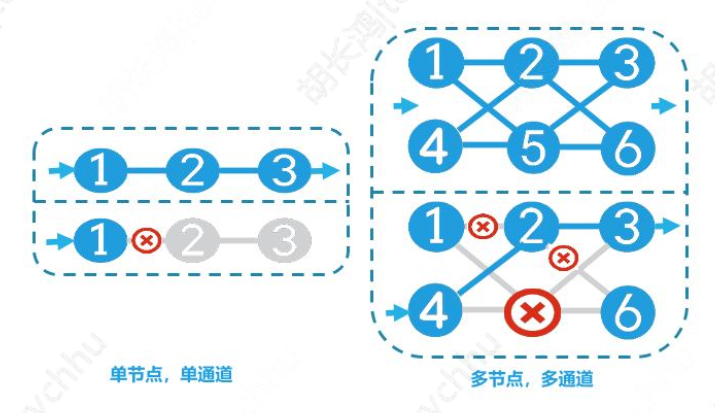
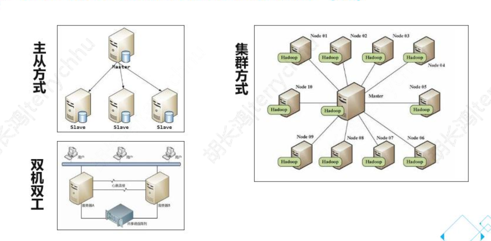

# 腾讯云架构师笔记

# 为什么要做架设设计

- 合理的成本 
- 满足业务需要
- 提供系统的可用性、可扩展性、安全性

## 高可用的概念 

- MTTF:平均无故障时间
- MTTR:平均修改时间

###  高可用性分级
 - 基本可用性 99 一年87小时
 - 极高可用性 99999 一年5分钟

### 高可用性设计原则
两方面着手考虑
 - 降低出错概率
 - 减少修复时间
 具体操作
 - 评估需要可用性达到级别 
 - 采用冗余设计提高容错性
 - 伸缩性缓解高峰期以及业务增加长产生的压力

高可用提高，成本提高
- RPO(Recovery Point Object): 灾难过程中的最大数据丢失量，衡量容灾系统数据冗余备份能力，例如每12小时，每1小时有一个备份一次
- RTO(Recovery Time Object):从灾难状态恢复到可运行状态的时间

### 高可用设计原则--评估分级
- 时间段内 可用性的时间要求 含计划和非计划的
- 业务指标量和响应时间
- 特殊时间段可用性棣
例子：电商平台 7x24小时，邮件系统7x24小时

### 高可用设计原则--冗余设计
从单节点，单通路 到多节点，多通路

- 网络
- 存储
- 计算

工作方工

- 主从方式

- 双机双工

- 集群工作

  

### 高可用设计原则--伸缩性
- 提升带宽
- 存储
- 增加计算力

### 云可以提供的高可用服务

- 硬件机房，多运营商接入
-  虚拟化，实例故障自动迁移
- 高可用组件

